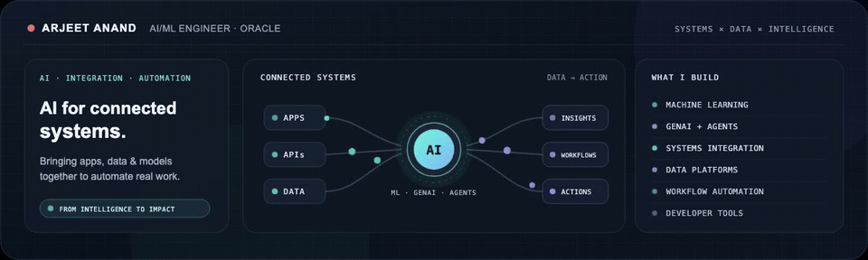

  

Click the animation to watch the full MP4 ↗

  

  
  
  
  

<strong>AI / ML</strong> · <strong>Systems integration</strong> · <strong>Data platforms</strong> · <strong>Intelligent automation</strong>

## What I build

I’m an **AI/ML Engineer at Oracle**. I build intelligent systems that connect applications, data, and models—and turn that foundation into useful, dependable automation. My work spans machine learning, GenAI, enterprise integration, data engineering, agents, APIs, and developer tools.

## Highlights

<table>
  <tr>
    <td width="50%" valign="top">
      01 / BUILDER AWARD 
      <strong>Razorpay × Replit Buildathon</strong> 
      Winner · Sprint Saturday · Bengaluru · Sep 2026  
      <a href="https://luma.com/z9i53l4x">Event details ↗</a>
    </td>
    <td width="50%" valign="top">
      02 / ORACLE AI &amp; DATA SCIENCE 
      <strong>Co-author · <a href="https://blogs.oracle.com/ai-and-datascience/mcp-hybrid-rag-in-oracle-26ai">From Vector Index to MCP Tool</a></strong> 
      Building Hybrid RAG in Oracle Autonomous AI Database 26ai.  
      <a href="https://blogs.oracle.com/ai-and-datascience/mcp-hybrid-rag-in-oracle-26ai">Read the article ↗</a> · <a href="https://www.linkedin.com/posts/arjeetanand_from-vector-index-to-mcp-tool-from-vector-activity-7467621510829182976-lHSe">LinkedIn post ↗</a>
    </td>
  </tr>
</table>

## Featured builds

<table>
  <tr>
    <td width="50%" valign="top">
      <strong><a href="https://github.com/arjeetanand/onboard-repo-copilot">01 / Onboard Repo Copilot</a></strong> 
      Evidence-backed repository onboarding with cited Q&amp;A and human handoff.  
      Python · FastAPI · React · SQLite
    </td>
    <td width="50%" valign="top">
      <strong><a href="https://github.com/arjeetanand/DataMind">02 / DataMind</a></strong> 
      Retail analytics across streaming data, forecasting, RAG, and agent workflows.  
      Kafka · ClickHouse · DuckDB · Redis
    </td>
  </tr>
  <tr>
    <td width="50%" valign="top">
      <strong><a href="https://github.com/arjeetanand/mcp-security-gateway">03 / MCP Security Gateway</a></strong> 
      Policy-gated MCP tools with role-based access, approvals, and audit logs.  
      Python · FastAPI · MCP
    </td>
    <td width="50%" valign="top">
      <strong><a href="https://github.com/arjeetanand/artha-shopping-agent">04 / Artha Shopping Agent</a></strong> 
      Source-linked product research with permissioned location and checkout adapters.  
      Python · AI agents · Shopping workflows
    </td>
  </tr>
</table>

<a href="https://github.com/arjeetanand?tab=repositories"><strong>Explore all repositories →</strong></a>

## Toolbox

**AI &amp; ML:** Machine learning · GenAI · RAG · Agents · MCP · A2A 
**Integration &amp; automation:** Oracle Integration Cloud · APIs · workflow automation 
**Data &amp; engineering:** Python · SQL · Kafka · FastAPI · ClickHouse 
**Oracle platforms:** Autonomous AI Database 26ai · OCI

## Background

B.Tech. in Electronics and Communication Engineering · Vellore Institute of Technology · 2020–2024
